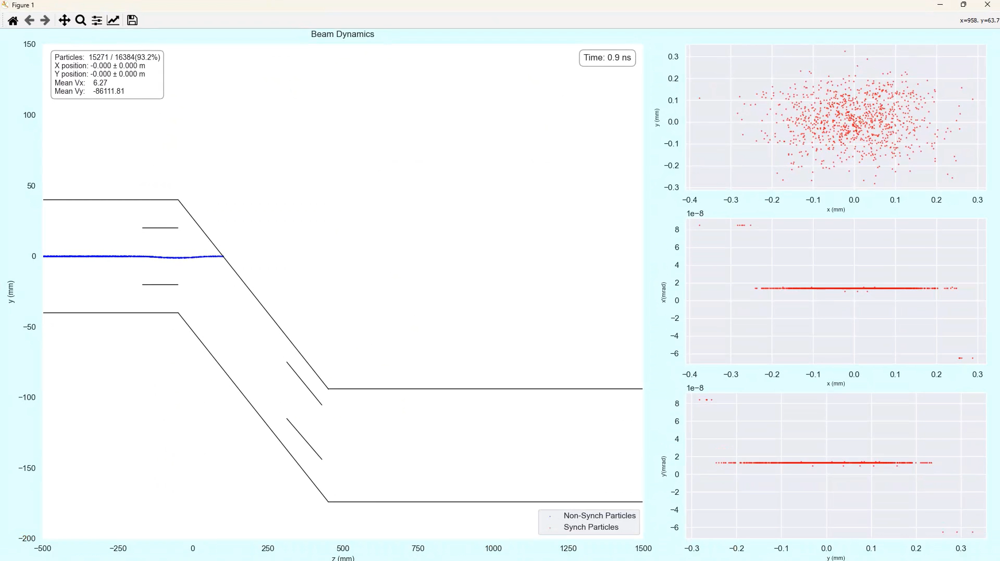

# Master-Thesis
A new electron accelerator, Rhodotron, has been designed and constructed at Boğaziçi University Kandilli Detector, Accelerator, and Instrumentation Laboratory (KAHVELab). Rhodotron accelerator accepts an electron beam with a bunch length of at most 1 ns. Therefore, a chopper system is needed to accomplish 1 ns or less electron bunch from 1 μs electron bunch. This master’s thesis aims to design a chopper system to bunch electrons for the Rhodotron accelerator.
## CST Simulation:

## Python Simulation:

